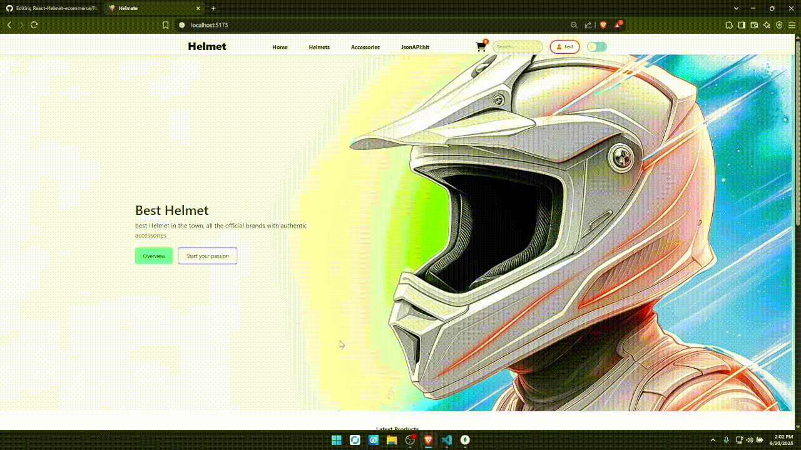

# 🛡️ Surround-Helm

A **full-stack web application** for managing and showcasing helmet products. Built using **Node.js/Express** (backend) and **React** (frontend), it features secure authentication, product management, image uploads, shopping cart, and a sleek modern UI.

---

## 🚀 Live Demo

> 🗼️ Demo GIFs & Screenshots
### 🔐 Signup & Login


### ➕ Add Product


### ✏️ Update/Delete Product


### 🛒 Cart Actions



### 🌗 Theme Toggle
.gif)

### ✅ Checkout/Login Check

---

## 📋 Table of Contents

* [✨ Features](#-features)
* [📁 Folder Structure](#-folder-structure)
* [🛠️ Usage](#️-usage)
* [📚 API Endpoints](#-api-endpoints)
* [🤝 Contributing](#-contributing)

---

## ✨ Features

* 🔐 JWT-based User Authentication (`bcrypt`, `jsonwebtoken`)
* 🧢 Add/Edit/Delete/View helmet products
* 📦 Image Upload (Multer / Cloud storage ready)
* 🛍️ User-specific product & cart management
* 🔎 Search & Filter functionality
* 🌑 Light/Dark Theme Toggle

---

## 📁 Folder Structure

```bash
Surround-Helm/
│
├── backend/          # Node.js + Express API (routes, models, controllers)
├── src/              # React app (components, pages, hooks, context)
├── public/           # Static frontend assets
├── package.json      # Frontend dependencies & scripts
├── vite.config.js    # Frontend build config (Vite)
├── README.md         # You're reading it!
```

## 🛠️ Usage Guide

* 🔑 **Register/Login** to manage your products
* 📟 **Browse/Search/Filter** helmet products
* 🖼️ **Add new products** with image uploads
* ✏️ **Edit or delete** your own listings
* 🛎️ **Add to cart** and simulate checkout

---

## 📚 API Endpoints

### 🔐 Auth Routes

| Method | Endpoint               | Description                   |
| ------ | ---------------------- | ----------------------------- |
| POST   | `/api/auth/createuser` | Register a new user           |
| POST   | `/api/auth/login`      | Login existing user           |
| GET    | `/api/auth/getuser`    | Get logged-in user info (JWT) |

### 🧢 Product Routes

| Method | Endpoint                         | Description                      |
| ------ | -------------------------------- | -------------------------------- |
| GET    | `/api/product/getallproduct`     | List all products                |
| GET    | `/api/product/getproduct`        | List products by logged-in user  |
| POST   | `/api/product/addproduct`        | Add product (JWT + image upload) |
| PUT    | `/api/product/updateproduct/:id` | Update product (JWT required)    |
| DELETE | `/api/product/deleteproduct/:id` | Delete product (JWT required)    |

---

## 🤝 Contributing

Contributions are welcome! Please fork the repo, create a branch, and submit a pull request.

> For major changes, open an issue first to discuss the proposed improvement.

